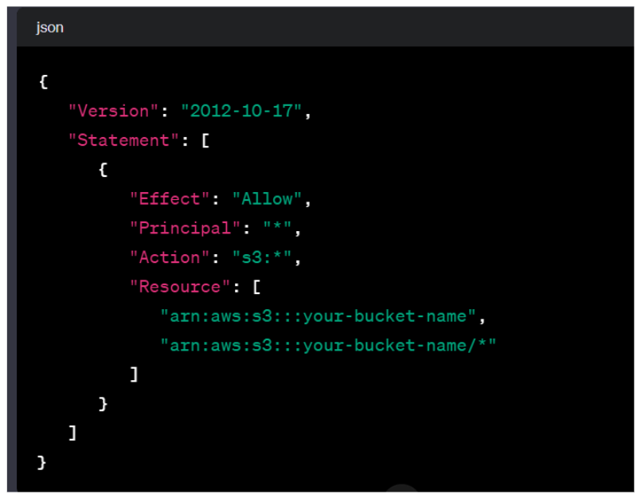

# 🚀 Amazon S3 🚀
 
## Amazon S3 - Introduction

Amazon S3, or Simple Storage Service, is a fundamental component of AWS offering infinitely scalable storage for various use cases. Key applications include:

- **Backup and Storage:**
  - S3 serves as a reliable and scalable solution for data backup and long-term storage.

- **Disaster Recovery:**
  - With its high durability and availability, S3 is a crucial element in disaster recovery strategies.

- **Archive:**
  - Organizations leverage S3 to archive data, providing cost-effective long-term storage with easy retrieval.

- **Host Applications:**
  - S3 can host static files for web applications, providing a secure and scalable content delivery solution.

- **Media Hosting:**
  - Content creators and media companies use S3 for storing and serving multimedia files due to its efficiency and low-latency access.

- **Static Websites:**
  - Hosting static websites on S3 is a popular choice, benefiting from its simplicity, reliability, and cost-effectiveness.

Amazon S3's versatility and scalability make it a cornerstone for a wide array of storage needs within the AWS ecosystem.

## S3 - Buckets
- `S3` allows us to store objects in buckets.(object semiliear file,folder)
- Buckets must have globally unique name in AWS
- Buckets are defined at regional level
- `S3` dashboard is global scoped but buckets inside the dashboard are regional service (`So S3 is a regional service with global dashboard`)

## S3 - Objects

In Amazon S3, objects are fundamental units of storage, each identified by a unique key. The key represents the full path within the bucket, creating a hierarchical structure, but it's important to note that S3 doesn't have an actual directory system.

### Object Key Structure:

- Example: `s3://the_bucket/the_file.txt` or `s3://the_bucket/folder/another_folder/the_file.txt`
- The object key is composed of two parts:
  - Prefix: `/folder/another_folder`
  - Object Name: `the_file.txt`
  
**Note:** Despite appearances, `S3 doesn't have a directory system`, even though it may seem look like directory system.

### The objects have key and value
- Values are the content of the body
- `Max object size is 5TB`
- `If uploading more than 5GB, must use multipart upload.` If file size more then > 5GB, should be used seperate file means multipart.

## S3 Security
- User based
    - IAM policies - Which api calls should be allowed to be allowed for a user
- Resource based
    - S3 bucket policies - Bucket wide rules from the s3 console - allows: 
        - cross account
        - Specific users
    - Object access control list (ACL)
    - Bucket access control list (ACL)

An IAM principal can access an S3 object if
1. The user iam policy allows it / the resource policy allows it
2. And there no explicit deny

## S3 Bucket Policy 
<table>
  <tr>
    <td>
      <ul>
        <h3>Typically route traffic to a single resource:</h3>
          - This implies that S3 bucket policies are often designed to manage and control access to a specific S3 resource.
        <li><b>Resources:</b> bucket and objects</li>
          - Specifies the entities (bucket and objects) that the policy applies to.
        <li><b>Principal:</b> iam user/account</li>
          - Defines the IAM user or AWS account that the policy is applied to, specifying who is granted or denied access.
        <h3>Use s3 bucket for policy to:</h3>
          - Indicates specific use cases for implementing S3 bucket policies.
        <li>Grant public access to the bucket</li>
          - Grants public access to the content stored in the bucket, potentially for hosting static websites or making certain files publicly accessible.
        <li>Force objects to be encrypted at upload</li>
          - Ensures that any objects uploaded to the bucket are encrypted, enhancing the security of stored data.
        <li>Grant access to another account</li>
          - Allows cross-account access, enabling specified AWS accounts to access the resources in the S3 bucket.
      </ul>
    </td>
    <td></td>
  </tr>
</table>
